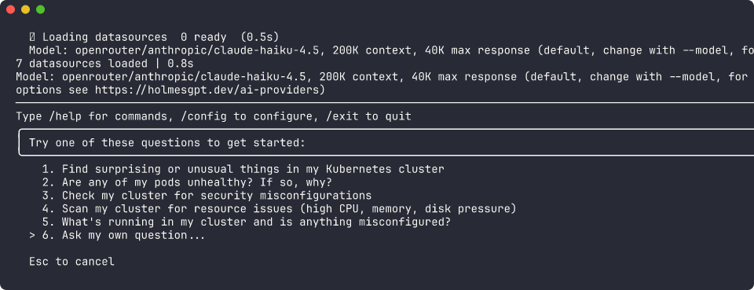
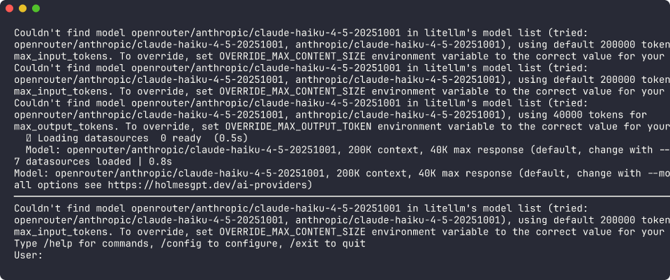
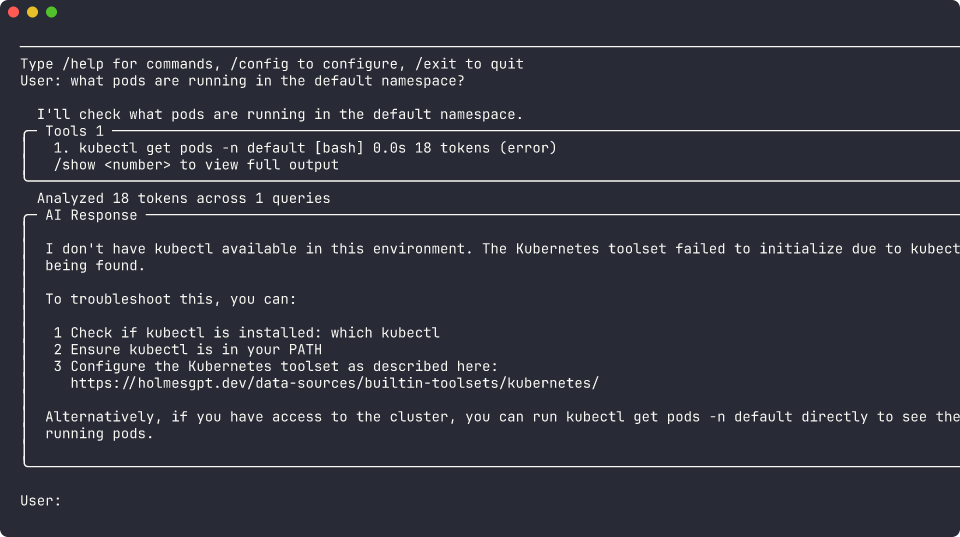
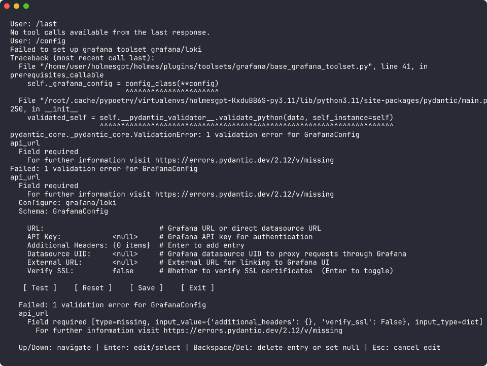
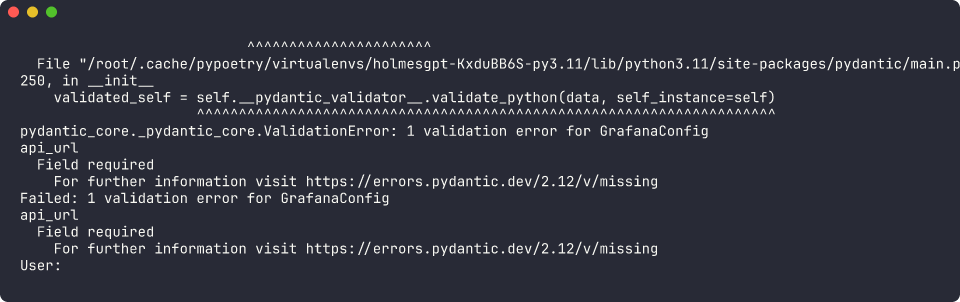
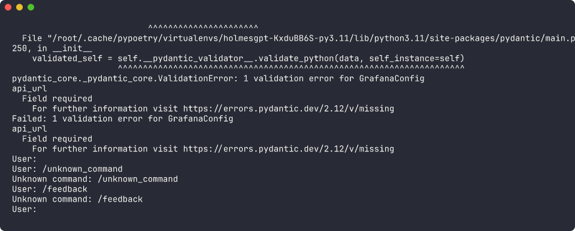
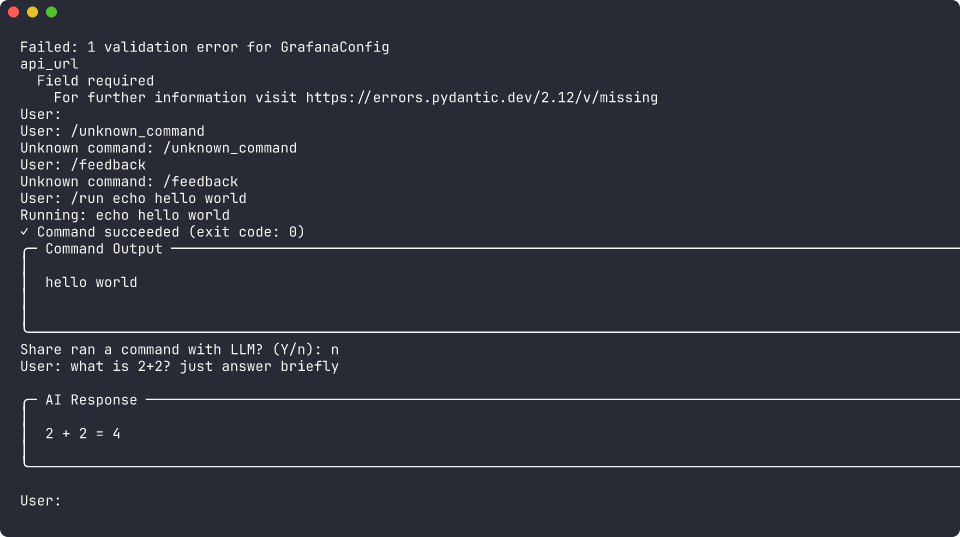
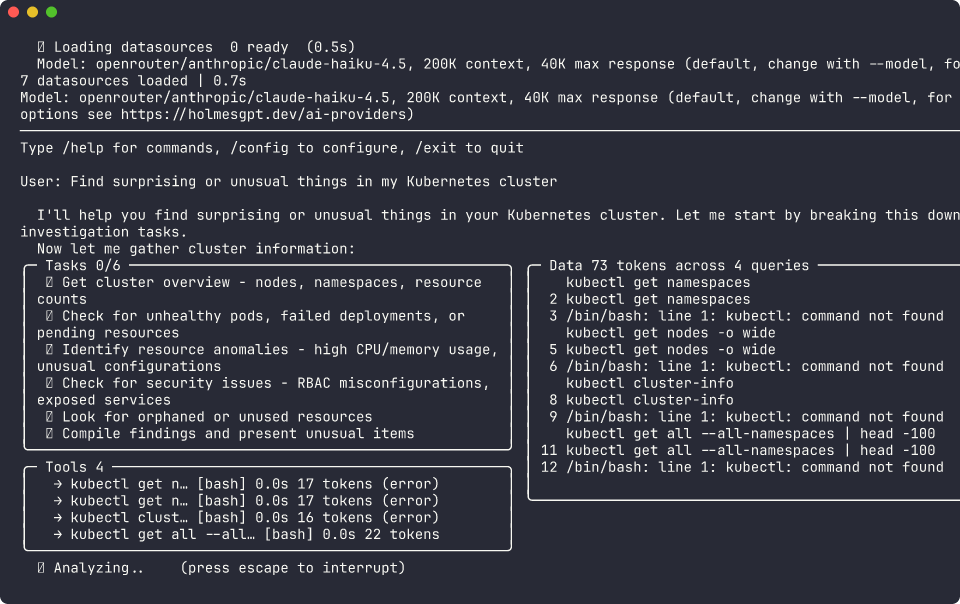
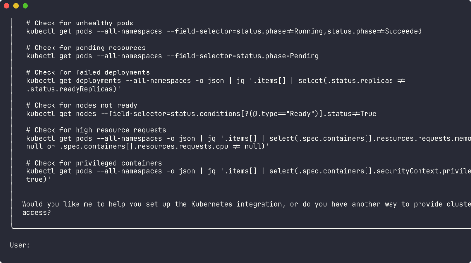

# HolmesGPT Interactive CLI — Virtui Test Screenshots

All screenshots captured using [virtui](https://github.com/honeybadge-labs/virtui) v0.1.4 driving `holmes ask -i` with `openrouter/anthropic/claude-haiku-4.5`. Terminal: 120x40. Images rendered with [freeze](https://github.com/charmbracelet/freeze).

## Table of Contents

1. [Welcome Screen](#1-welcome-screen)
2. [User Prompt](#2-user-prompt)
3. [Question + AI Response](#3-question-ai-response)
4. [`/help` Command](#4-help-command)
5. [`/tools` Command](#5-tools-command)
6. [`/context` Command](#6-context-command)
7. [`/show 1` — Scrollable Tool Output Modal](#7-show-1-scrollable-tool-output-modal)
8. [`/clear` Command](#8-clear-command)
9. [`/config` — Toolset Selector](#9-config-toolset-selector)
10. [`/config` — Field Editor](#10-config-field-editor)
11. [BUG — Raw Traceback in Config TUI](#11-bug-raw-traceback-in-config-tui)
12. [BUG — Traceback Bleeds Into Scrollback](#12-bug-traceback-bleeds-into-scrollback)
13. [Ctrl+C While Typing](#13-ctrlc-while-typing)
14. [`/run` Command — Success](#14-run-command-success)
15. [Simple AI Response](#15-simple-ai-response)
16. [Sample Question Navigation](#16-sample-question-navigation)
17. [Tasks Panel + Analyzing Spinner](#17-tasks-panel-analyzing-spinner)
18. [Full AI Response](#18-full-ai-response)
19. [`/run` — Failed Command](#19-run-failed-command)
20. [`/exit` Command](#20-exit-command)

---

## 1. Welcome Screen

Initial welcome screen showing loaded datasources, model info, and sample questions menu.

## 2. User Prompt

After selecting 'Ask my own question' — the `User:` input prompt.

## 3. Question + AI Response

Asking about k8s pods triggers a tool call (kubectl) and renders the response in a bordered panel.

## 4. `/help` Command

Lists all available slash commands with descriptions.

## 5. `/tools` Command

Rich table of all toolsets with status and error reasons.

## 6. `/context` Command

Token usage breakdown: system prompt, user, assistant, and tool responses.

## 7. `/show 1` — Scrollable Tool Output Modal

Full-screen viewer with vim-style navigation (j/k/g/G/d/u/f/b, w toggles wrap, q exits).

## 8. `/clear` Command

Clears screen and resets conversation context.

## 9. `/config` — Toolset Selector

Configuration TUI showing all toolsets and their current state.

## 10. `/config` — Field Editor

Selecting `grafana/loki` opens a field editor showing the Pydantic config schema with inline editing.

## 11. BUG — Raw Traceback in Config TUI

Pressing **Test** with missing required fields dumps a raw `pydantic.ValidationError` traceback. Root cause: `base_grafana_toolset.py:45` calls `logging.exception(...)` before `run_config_test()` catches it.

## 12. BUG — Traceback Bleeds Into Scrollback

After Ctrl+C out of the config TUI, the traceback remains visible. Arrow keys and Escape became non-responsive after the error — only Ctrl+C worked.

## 13. Ctrl+C While Typing

Clears input and shows hint: `Input cleared. Use /exit or Ctrl+C again to quit.`

## 14. `/run` Command — Success

Running `echo hello world` renders a bordered Command Output panel and prompts to share with LLM.

## 15. Simple AI Response

A factual question (2+2) renders cleanly in a bordered AI Response panel.

## 16. Sample Question Navigation

Arrow-key navigation through the sample questions menu (cursor on option 1).

## 17. Tasks Panel + Analyzing Spinner

LLM planning creates a Tasks panel (0/6) with a live spinner while tools execute.

## 18. Full AI Response

Complete response with markdown code blocks rendered inside a bordered panel.

## 19. `/run` — Failed Command

Exit code 127 reported with `Command failed` header — handled gracefully.

## 20. `/exit` Command

Clean shutdown with `Exiting interactive mode.` message.

